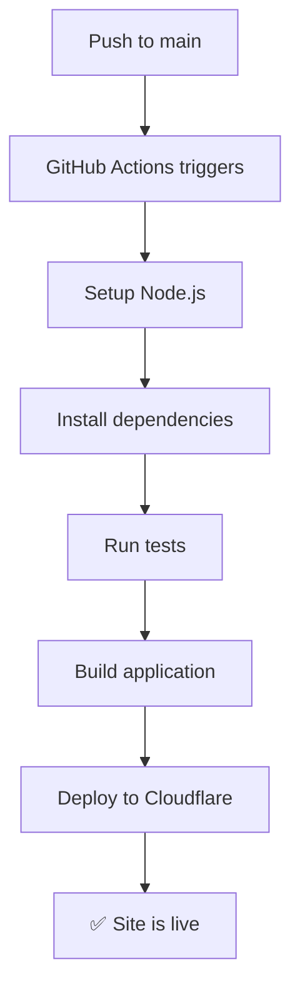

# 🔄 إعداد GitHub Actions للنشر التلقائي

هذا الدليل يوضح كيفية إعداد النشر التلقائي من GitHub إلى Cloudflare Pages.

## 📋 المتطلبات

### 1. حساب Cloudflare مع Pages
- حساب Cloudflare مُفعل
- مشروع Cloudflare Pages منشأ

### 2. مستودع GitHub
- مشروع مرفوع على GitHub
- صلاحيات للإعدادات (Settings)

## 🔑 إعداد API Tokens

### الخطوة 1: إنشاء Cloudflare API Token

1. اذهب إلى [Cloudflare API Tokens](https://dash.cloudflare.com/profile/api-tokens)
2. اضغط "Create Token"
3. استخدم قالب "Custom token"
4. إعدادات التوكن:

```
Token name: GitHub Actions - Open Lovable
Permissions:
  - Account: Cloudflare Pages:Edit
  - Zone: Zone:Read (if using custom domain)
Account Resources:
  - Include: All accounts
Zone Resources:
  - Include: All zones (or specific zone)
```

5. اضغط "Continue to summary"
6. اضغط "Create Token"
7. **احفظ التوكن فوراً** (لن يظهر مرة أخرى)

### الخطوة 2: الحصول على Account ID

1. من Cloudflare Dashboard الرئيسي
2. في الجانب الأيمن، ستجد "Account ID"
3. اضغط على أيقونة النسخ
4. احفظ الـ ID

## 🔒 إعداد GitHub Secrets

### إضافة Secrets المطلوبة

1. اذهب إلى مستودع GitHub
2. Settings > Secrets and variables > Actions
3. اضغط "New repository secret"

أضف هذه الـ Secrets:

#### المطلوبة للنشر:
```
CLOUDFLARE_API_TOKEN
- Value: التوكن من الخطوة السابقة

CLOUDFLARE_ACCOUNT_ID  
- Value: Account ID من Cloudflare
```

#### اختيارية (للميزات المتقدمة):
```
OPENAI_API_KEY
- Value: sk-your-openai-key

ANTHROPIC_API_KEY
- Value: sk-ant-your-key

E2B_API_KEY
- Value: e2b-your-key
```

## 🚀 اختبار النشر

### تفعيل Workflow

1. ادفع أي تغيير إلى `main` أو `master`:
```bash
git add .
git commit -m "تفعيل النشر التلقائي"
git push origin main
```

2. راقب العملية في GitHub:
   - اذهب إلى مستودعك > Actions
   - ستجد workflow يعمل اسمه "Deploy to Cloudflare Pages"

### مراحل النشر



## 📊 مراقبة النشر

### GitHub Actions Logs

1. في مستودعك > Actions
2. اضغط على آخر workflow run
3. راقب كل خطوة:
   - ✅ Checkout code
   - ✅ Setup Node.js  
   - ✅ Install dependencies
   - ✅ Run tests
   - ✅ Build application
   - ✅ Deploy to Cloudflare

### Cloudflare Pages Dashboard

1. في [Cloudflare Pages](https://dash.cloudflare.com/pages)
2. اضغط على مشروعك
3. راقب "Deployments" tab

## 🔧 تخصيص Workflow

### إضافة اختبارات

عدل `.github/workflows/deploy-cloudflare.yml`:

```yaml
- name: Run unit tests
  run: npm test

- name: Run integration tests  
  run: npm run test:integration

- name: Run E2E tests
  run: npm run test:e2e
```

### إضافة تحقق من الجودة

```yaml
- name: Run TypeScript check
  run: npx tsc --noEmit

- name: Run ESLint
  run: npm run lint

- name: Check formatting
  run: npx prettier --check .
```

### النشر على Environments مختلفة

```yaml
strategy:
  matrix:
    environment: [staging, production]

steps:
  - name: Deploy to ${{ matrix.environment }}
    uses: cloudflare/pages-action@v1
    with:
      projectName: open-lovable-${{ matrix.environment }}
```

## 🚨 حل المشاكل الشائعة

### خطأ: "API token invalid"
- تأكد من صحة CLOUDFLARE_API_TOKEN
- تحقق من صلاحيات التوكن
- أنشئ توكن جديد إذا لزم الأمر

### خطأ: "Account ID not found"
- تحقق من CLOUDFLARE_ACCOUNT_ID
- تأكد من نسخ الـ ID بشكل صحيح

### خطأ: "Build failed"
- راجع logs الـ build في GitHub Actions
- تأكد من أن الكود يعمل محلياً
- تحقق من dependencies

### خطأ: "Project not found"
- تأكد من اسم المشروع في Cloudflare Pages
- عدل `projectName` في workflow إذا لزم

## 📚 إعدادات متقدمة

### متغيرات البيئة في Workflow

```yaml
env:
  NODE_ENV: production
  NEXT_TELEMETRY_DISABLED: 1
  CUSTOM_VAR: ${{ secrets.CUSTOM_SECRET }}
```

### Caching للسرعة

```yaml
- name: Cache dependencies
  uses: actions/cache@v3
  with:
    path: ~/.npm
    key: ${{ runner.os }}-node-${{ hashFiles('**/package-lock.json') }}
    restore-keys: |
      ${{ runner.os }}-node-
```

### إشعارات النشر

```yaml
- name: Notify on success
  if: success()
  run: |
    curl -X POST -H 'Content-type: application/json' \
    --data '{"text":"✅ Open Lovable deployed successfully!"}' \
    ${{ secrets.SLACK_WEBHOOK_URL }}
```

## ✅ قائمة التحقق

- [ ] Cloudflare API Token منشأ ومحفوظ
- [ ] Account ID محفوظ
- [ ] GitHub Secrets مُعدة بشكل صحيح
- [ ] Workflow file في المكان الصحيح
- [ ] اختبار أول push نجح
- [ ] الموقع يعمل على الرابط المطلوب

---

🎉 **الآن لديك نشر تلقائي كامل من GitHub إلى Cloudflare Pages!**

كل مرة تدفع فيها كود إلى `main`، سيتم نشر الموقع تلقائياً. 🚀