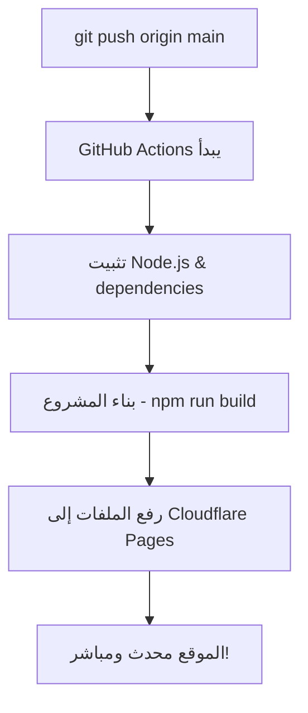

# 🚀 دليل إعداد النشر التلقائي - خطوة بخطوة

## الخطوة 1: إنشاء Cloudflare API Token

### أ) الذهاب إلى Cloudflare
1. اذهب إلى [Cloudflare API Tokens](https://dash.cloudflare.com/profile/api-tokens)
2. اضغط **"Create Token"**

### ب) إعداد التوكن
1. اختر **"Custom token"**
2. املأ التفاصيل:

```
Token name: GitHub Actions - Open Lovable Deploy

Permissions:
✅ Account - Cloudflare Pages:Edit
✅ Zone - Zone:Read (if using custom domain)

Account Resources:
✅ Include - All accounts

Zone Resources: 
✅ Include - All zones
```

3. اضغط **"Continue to summary"**
4. اضغط **"Create Token"**
5. **انسخ التوكن فوراً** (لن يظهر مرة أخرى!)

---

## الخطوة 2: الحصول على Account ID

1. في Cloudflare Dashboard الرئيسي
2. في الجانب الأيمن، ستجد **"Account ID"**
3. اضغط على أيقونة النسخ 📋
4. احفظ الـ ID

---

## الخطوة 3: إضافة Secrets في GitHub

### أ) الذهاب إلى GitHub Secrets
1. اذهب إلى: https://github.com/you112ef/open-lovable
2. اضغط **Settings**
3. من القائمة اليسار: **Secrets and variables** > **Actions**
4. اضغط **"New repository secret"**

### ب) إضافة السرين المطلوبين

#### Secret 1: CLOUDFLARE_API_TOKEN
```
Name: CLOUDFLARE_API_TOKEN
Secret: [التوكن من الخطوة 1]
```
اضغط **"Add secret"**

#### Secret 2: CLOUDFLARE_ACCOUNT_ID
```
Name: CLOUDFLARE_ACCOUNT_ID  
Secret: [Account ID من الخطوة 2]
```
اضغط **"Add secret"**

---

## الخطوة 4: تشغيل النشر التلقائي

### أ) اختبار أول نشر
1. ارجع إلى مستودع المشروع
2. اذهب إلى **Actions** tab
3. ستجد workflow اسمه **"Deploy to Cloudflare Pages"**

### ب) تشغيل النشر يدوياً (للاختبار)
1. اضغط على workflow **"Deploy to Cloudflare Pages"**
2. اضغط **"Run workflow"**
3. اختر **"main"** branch
4. اضغط **"Run workflow"**

### ج) النشر التلقائي
من الآن، **كل مرة تدفع فيها كود إلى main**:
- سيعمل GitHub Actions تلقائياً
- سيبني المشروع  
- سينشر على Cloudflare Pages

---

## الخطوة 5: إنشاء مشروع Cloudflare Pages

### أ) إنشاء المشروع
1. اذهب إلى [Cloudflare Pages](https://dash.cloudflare.com/pages)
2. اضغط **"Create a project"**
3. اختر **"Direct upload"** (لأن GitHub Actions سيرفع الملفات)

### ب) تسمية المشروع
```
Project name: open-lovable
```
اضغط **"Create project"**

### ج) إعداد Environment Variables (اختياري)
في صفحة المشروع > **Settings** > **Environment variables**:

```
OPENAI_API_KEY = sk-your-openai-key
ANTHROPIC_API_KEY = sk-ant-your-key  
E2B_API_KEY = e2b-your-key
NEXT_PUBLIC_APP_URL = https://open-lovable.pages.dev
```

---

## ✅ اختبار النشر

### مراقبة العملية
1. **GitHub Actions**: https://github.com/you112ef/open-lovable/actions
2. **Cloudflare Pages**: https://dash.cloudflare.com/pages

### التحقق من النجاح
1. في GitHub Actions، ستجد ✅ عند نجاح النشر
2. في Cloudflare Pages، ستجد deployment جديد
3. الموقع سيعمل على: `https://open-lovable.pages.dev`

---

## 🔄 كيف يعمل النشر التلقائي



### ما يحدث تلقائياً:
1. **عند push إلى main**: GitHub Actions يبدأ
2. **البناء**: `npm run build` ينتج ملفات في `/out`
3. **النشر**: الملفات ترفع لـ Cloudflare Pages
4. **التحديث**: الموقع يحدث فوراً

---

## 🚨 في حالة وجود مشاكل

### خطأ: "API token invalid"
- تأكد من نسخ التوكن بشكل صحيح
- تحقق من صلاحيات التوكن
- أنشئ توكن جديد إذا لزم

### خطأ: "Project not found" 
- تأكد من إنشاء مشروع في Cloudflare Pages
- تحقق من اسم المشروع في workflow (يجب أن يكون `open-lovable`)

### خطأ: "Build failed"
- راجع logs في GitHub Actions
- تأكد من أن المشروع يبني محلياً (`npm run build`)

---

## 🎉 تهانينا!

الآن لديك **نشر تلقائي كامل**:
- ✅ كل push إلى main = نشر تلقائي
- ✅ اختبارات تلقائية قبل النشر
- ✅ مراقبة العملية في الوقت الفعلي
- ✅ موقع سريع وآمن على Cloudflare

**🚀 استمتع بالتطوير بدون عناء النشر!**